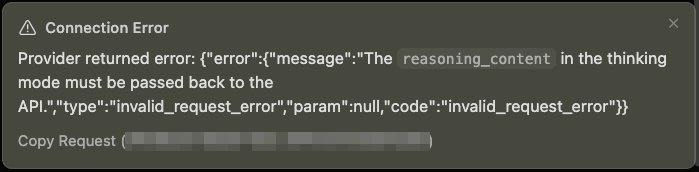
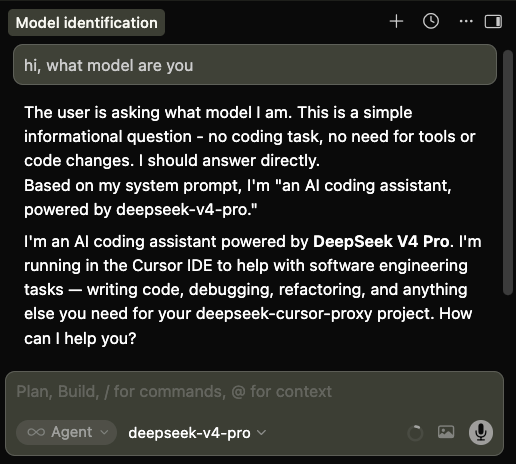

<!-- <h1>&nbsp;DeepSeek Cursor Proxy</h1> -->
<h1 align="center"><br>DeepSeek Cursor Proxy</h1>

A compatibility proxy that connects Cursor to DeepSeek thinking models (`deepseek-v4-pro` and `deepseek-v4-flash`) by properly handling the `reasoning_content` field for DeepSeek tool-call reasoning API requests.

This proxy can also help **other applications and coding agents** beyond Cursor that run into the same missing `reasoning_content` issue with DeepSeek's thinking-mode API. Just point their API base URL at the proxy.

## What It Does

- ✅ Injects `reasoning_content` into outgoing tool-call requests since Cursor does not include the field, restoring previously cached reasoning from regular and streamed DeepSeek responses. See [DeepSeek docs](https://api-docs.deepseek.com/guides/thinking_mode#tool-calls) for more details.
- ✅ Displays DeepSeek's thinking tokens in Cursor by forwarding them into Cursor-visible collapsible Markdown `<details><summary>Thinking</summary>...</details>` blocks.
- ✅ Supports public HTTPS URLs for seamless integration with Cursor.
- ✅ Provides other compatibility fixes to make DeepSeek models run well in Cursor.

## Why This Exists

This repository fixes the following Cursor + DeepSeek tool-call error with thinking mode enabled:



```txt
⚠️ Connection Error
Provider returned error:
{
  "error": {
    "message": "The reasoning_content in the thinking mode must be passed back to the API.",
    "type": "invalid_request_error",
    "param": null,
    "code": "invalid_request_error"
  }
}
```

## Usage

### Step 1: Deploy to a Public URL (Railway, Render, Coolify, etc.)

Cursor blocks non-public API URLs such as `localhost`, so the proxy needs a public HTTPS URL. For a permanent setup without time limits, you can deploy the proxy to any hosting platform that supports Docker deployments (e.g., Railway, Render, Coolify, Fly.io).

**General Docker Deployment Steps:**

1.  **Fork the Repository**: Fork this repo to your own GitHub/GitLab account.
2.  **Create New Project**: In your chosen hosting platform dashboard, create a new project and select **Deploy from GitHub repository**.
3.  **Configure Build**: The platform will automatically detect the `Dockerfile`. No custom build commands are needed.
4.  **Port Configuration**: The Dockerfile automatically respects the `$PORT` environment variable provided by most modern platforms (like Railway and Render). If your platform requires manual port configuration, it defaults to `9000`.
5.  **Set Up Persistence (Highly Recommended)**:
    - The proxy stores its configuration and reasoning cache in the `/data` directory inside the container.
    - To prevent losing this data when the container restarts, you must add a **Persistent Volume** in your hosting provider's settings and mount it to the **Destination Path** `/data`.
6.  **Deploy**: Click Deploy.
7.  **Get Your URL**: Once deployed, the platform will provide a permanent domain (e.g., `https://deepseek-proxy.your-domain.com`).
8.  **Cursor Configuration**: Use `https://your-deployment-url.com/v1` as the Base URL in Cursor.

**Why this is better:** This setup provides a permanent URL that won't expire. The Docker container is pre-configured to run with `--no-ngrok`, respects dynamic ports, and uses `/data/config.yaml` for persistence.

### Step 2: Install and Start the Proxy Server

**Run with UV**

```bash
# Install uv if you don't have it
curl -LsSf https://astral.sh/uv/install.sh | sh

# Install and start
# uv installs the program in .venv/ under the repo local folder
git clone https://github.com/yxlao/deepseek-cursor-proxy.git
cd deepseek-cursor-proxy
uv run deepseek-cursor-proxy
```

**Run with Conda**

```bash
# Install conda if you don't have it
# Follow: https://www.anaconda.com/docs/getting-started/miniconda/install/overview

# Install
conda create -n dcp python=3.10 -y
conda activate dcp
git clone https://github.com/yxlao/deepseek-cursor-proxy.git
cd deepseek-cursor-proxy
pip install -e .

# Start
deepseek-cursor-proxy
```

The proxy will print the local listening URL on start. If you are using a public URL (like Coolify), use that in Cursor's Base URL field.

On the first run, `deepseek-cursor-proxy` will create:

- `~/.deepseek-cursor-proxy/config.yaml`: the configuration file
- `~/.deepseek-cursor-proxy/reasoning_content.sqlite3`: the reasoning content cache

Persistent settings live in `~/.deepseek-cursor-proxy/config.yaml`. You can also override the config with command-line flags, for example:

```bash
# Hide thinking tokens displaying in Cursor UI
deepseek-cursor-proxy --no-display-reasoning

# Show full incoming and outgoing requests
deepseek-cursor-proxy --verbose

# Run on all interfaces (useful for Docker/remote access)
deepseek-cursor-proxy --host 0.0.0.0

# Use a different local port
deepseek-cursor-proxy --port 9000
```

### Step 3: Add Cursor Custom Model

In Cursor, add the DeepSeek custom model and point it at this proxy:

- Model: `deepseek-v4-pro`
- API Key: your DeepSeek API key
- Base URL: your public HTTPS URL (from Coolify) with the `/v1` path

The proxy respects the DeepSeek model name Cursor sends, such as `deepseek-v4-pro` or `deepseek-v4-flash`. The `model` field in `config.yaml` is used as a fallback only when a request does not include a model.

For example, if your URL is `https://deepseek-proxy.example.com`, use:

```text
https://deepseek-proxy.example.com/v1
```


Note: you can toggle the custom API on and off with:

- macOS: `Cmd+Shift+0`
- Windows/Linux: `Ctrl+Shift+0`

### Step 4: Chat with DeepSeek in Cursor

Select `deepseek-v4-pro` in Cursor and use chat or agent mode as usual.



## How It Works

- **Core fix:** DeepSeek's [thinking mode](https://api-docs.deepseek.com/guides/thinking_mode#tool-calls) requires `reasoning_content` from assistant tool-call messages to be passed back in subsequent requests, but Cursor omits this field, causing a 400 error. The proxy (`Cursor → Public URL → proxy → DeepSeek API`) stores `reasoning_content` from every DeepSeek response in a local SQLite cache, keyed by message signature, tool-call ID, and tool-call function signature, and patches outgoing requests with missing `reasoning_content` before they reach DeepSeek. On a cold cache (proxy restart, model switch), it logs and drops unrecoverable history, continues from the latest user request, and prefixes the next Cursor response with a notice.
- **Multi-conversation isolation:** To avoid collisions across concurrent conversations, the proxy scopes cache keys by a SHA-256 hash of the canonical conversation prefix (roles, content, and tool calls, excluding `reasoning_content`) plus the upstream model, configuration, and an API-key hash. Different threads get different scopes, so reused tool-call IDs do not collide. Byte-identical cloned histories produce identical scopes.
- **Context caching compatibility:** The proxy preserves compatibility by never injecting synthetic thread IDs, timestamps, or cache-control messages. It restores `reasoning_content` as the exact original string, so repeated prefixes remain intact for [DeepSeek context cache](https://api-docs.deepseek.com/guides/kv_cache). Cache hit rates are logged in the terminal output.
- **Additional compatibility fixes:** Beyond reasoning repair, the proxy converts legacy `functions`/`function_call` fields to `tools`/`tool_choice`, preserves required and named tool-choice semantics, normalizes `reasoning_effort` aliases, strips mirrored thinking display blocks from assistant content, flattens multi-part content arrays to plain text, and mirrors `reasoning_content` into Cursor-visible Markdown details blocks.

## Development

Run unit tests:

```bash
uv run python -m unittest discover -s tests
```

Run pre-commit hooks (code formatting and linting):

```bash
uv sync --dev
uv run pre-commit run --all-files
```

## Debugging

Run with verbose output:

```bash
deepseek-cursor-proxy --verbose
```

Run on a specific port for local testing:

```bash
deepseek-cursor-proxy --port 9000 --verbose
```

Capture full structured request traces for debugging:

```bash
deepseek-cursor-proxy --verbose --trace-dir ./trace-dumps
```

Use another config file:

```bash
deepseek-cursor-proxy --config ./dev.config.yaml
```

Clear the local reasoning cache:

```bash
deepseek-cursor-proxy --clear-reasoning-cache
```

## Credits

[yxlao](https://github.com/yxlao).
